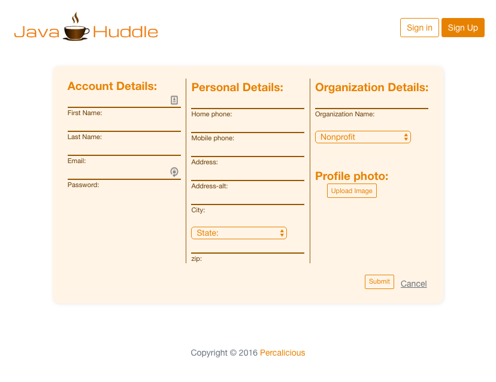
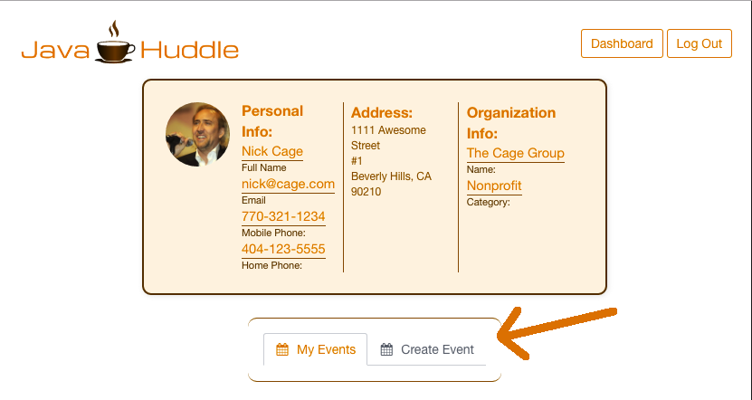
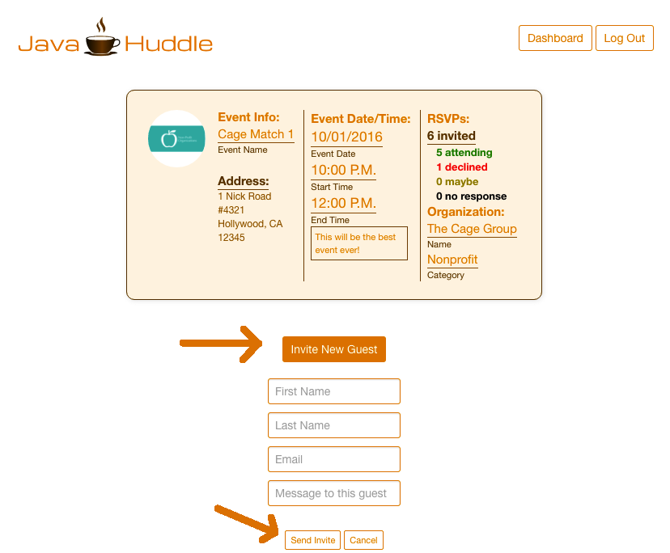
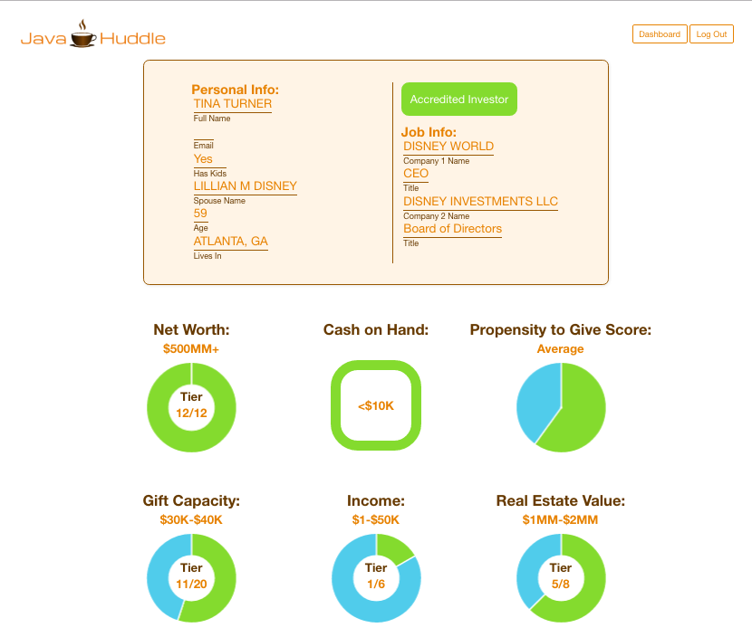

# JavaHuddle

##An app for nonprofit fundraisers and entrepreneurs that allows them to schedule coffee huddles with donors and investors, and also provides thorough wealth statistics on invitees immediately upon RSVP.

Built by:  
[Will Johnson](https://github.com/WilliamJohnsonJr "Will's GitHub")   
[Jason Steele](https://github.com/steeleio1 "Jason's GitHub")  
[Niclas Willems](https://github.com/MrAceman "Niclas' GitHub")

## Tools used:
AngularJS, JavaScript, Node.js, AdonisJS, HTML, SASS/SCSS, Angular UI Router, Angular Cookies, Angular Parallax, Angular Chart, Chart.js,
Mailgun API, WealthEngine API, Bulma (CSS framework), Gulp, and ES6.

## How It Works

### Step 1: Go to http://javahuddle.com and create an account

### Step 2: Sign In and click 'Create Event' under your profile information on your Dashboard to create an event.

### Step 3: Click on 'Event Details' for your event, then click 'Invite New Guest' and 'Send Invite' to invite people to your fundraising event via an automatically generated email invite.

### Step 4 (automatic): When your guest RSVPs via the email invite, their RSVP status is displayed on the Event Details page for your event. If they RSVP 'Yes', a WealthEngine report is automatically generated for them via the WealthEngine API and stored in our database.

### Step 5: View the Wealth Reports for each guest who RSVPed 'Yes' and craft your pitch for your upcoming JavaHuddle based upon their Wealth Data!

If you'd like to check out more of our team member's individual work, please visit our respective GitHub pages at:

Will Johnson: <https://github.com/WilliamJohnsonJr>

Jason Steele: <https://github.com/steeleio1>

Niclas Willems: <https://github.com/MrAceman>

If you have any questions please email us:

[Will Johnson](mailto:williamterryjohnsonjr@gmail.com)

[Jason Steele](mailto:steeleio1@mac.com)

[Niclas Willems](mailto:niclas.willems@gmail.com)  
#### Attributions:
Percolator logo from:
https://pixabay.com/en/coffee-kitchen-percolator-steam-158978/
License: CC0, Public Domain
